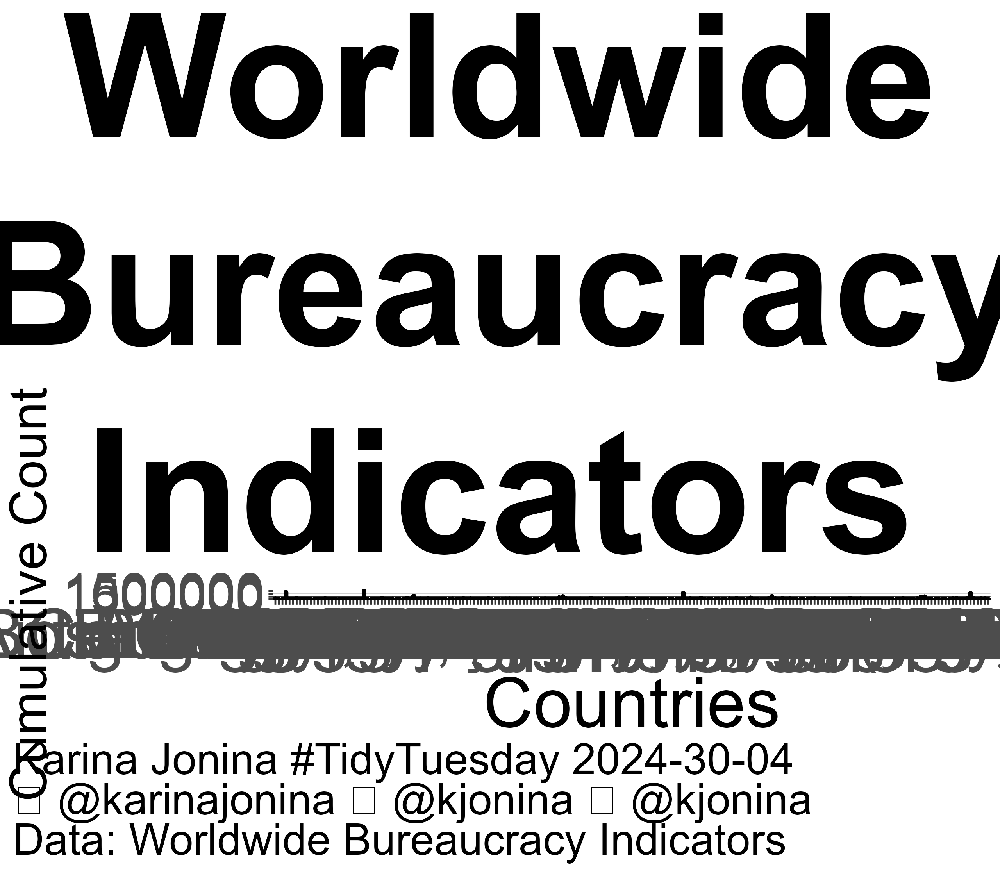

## About TidyTuesday

- `TidyTuesday` is a weekly social data project. All are welcome to participate! Please remember to share the code used to generate your results!
- `TidyTuesday` is organized by the [Data Science Learning Community](https://dslc.io). [Join our Slack](https://dslc.io/join) for free online help with R, Python, and other data-related topics, or to participate in a data-related book club!

## Goals

Our over-arching goal for TidyTuesday is to make learning to work with data easier, by providing real-world datasets.

Our goal for 2023-2024 is to increase usage of #TidyTuesday within classrooms.
We would like to be used in at least 10 courses by September 2024.
If you are using TidyTuesday to teach data-related skills, [please let us know](https://forms.gle/G1Y7doYqRU89m9SE8)! 

***
Click on header or the chart for the code.

## [2024-04-30: Worldwide Bureaucracy Indicators](https://github.com/kjonina/tidytuesday/blob/master/code/2024_04_30_tidy_tuesday.Rmd)

